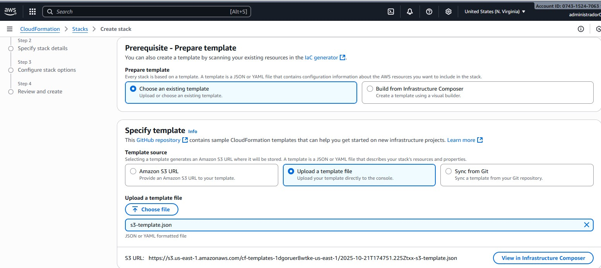
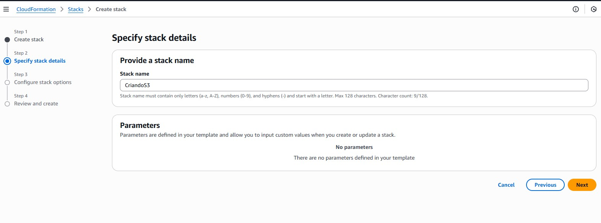
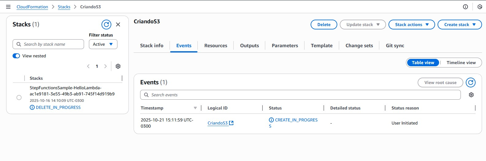
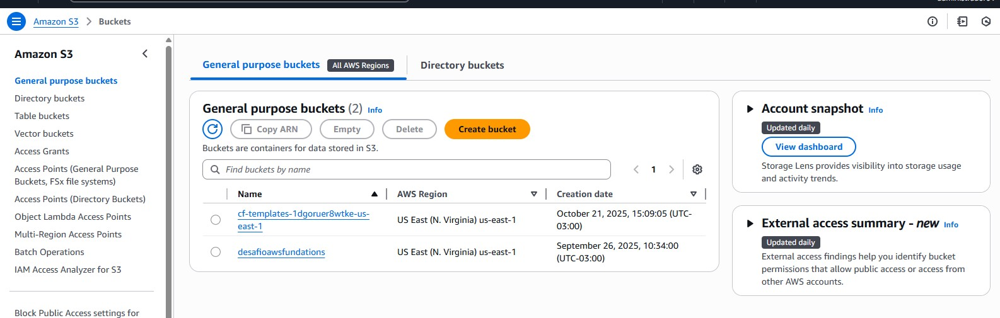

# Criando uma Stack no CloudFormation

Neste desafio, foi criada uma **Stack no AWS CloudFormation** que provisiona um **bucket S3** com o nome `meu-bucket-exemplo-cloudformation`.

O arquivo **`s3-template.json`** contém o código JSON responsável por criar esse bucket. O arquivo foi baixado e utilizado para o upload no CloudFormation.

---

## 🧩 Etapas de Criação

### 1️⃣ Escolha do Template

Durante a criação da Stack, selecionei as opções:

- **Choose an existing template**  
- **Upload a template file (Specify template)**  

Em seguida, fiz o upload do arquivo **`s3-template.json`**, conforme mostrado na figura abaixo:



---

### 2️⃣ Definição do Nome da Stack

Ao clicar em **Next**, é necessário definir o nome da Stack.  
Neste exemplo, o nome foi configurado conforme mostrado abaixo:



---

### 3️⃣ Criação da Stack

Após seguir as etapas, a Stack foi criada com sucesso, conforme demonstrado na figura a seguir:



---

### 4️⃣ Verificação no S3

Ao acessar o console do **Amazon S3**, é possível visualizar **dois buckets**:

- O bucket criado neste desafio (`meu-bucket-exemplo-cloudformation`)
- Outro bucket já existente (`desafioawsfundations`)



---

## ✅ Conclusão

O desafio demonstrou o uso do **AWS CloudFormation** para automatizar a criação de recursos na AWS.  
Com apenas um template JSON, foi possível provisionar um bucket S3 de forma rápida, padronizada e reproduzível, garantindo consistência na infraestrutura.

---

## 📄 Template Utilizado (`s3-template.json`)

Abaixo está o conteúdo do template utilizado para criar o bucket S3:

```json
{
  "AWSTemplateFormatVersion": "2010-09-09",
  "Description": "Template básico - Criação de um bucket S3 com CloudFormation",

  "Resources": {
    "MeuBucketS3": {
      "Type": "AWS::S3::Bucket",
      "Properties": {
        "BucketName": "meu-bucket-exemplo-cloudformation",
        "AccessControl": "Private"
      }
    }
  },

  "Outputs": {
    "BucketName": {
      "Description": "Nome do bucket criado",
      "Value": {
        "Ref": "MeuBucketS3"
      }
    }
  }
}

